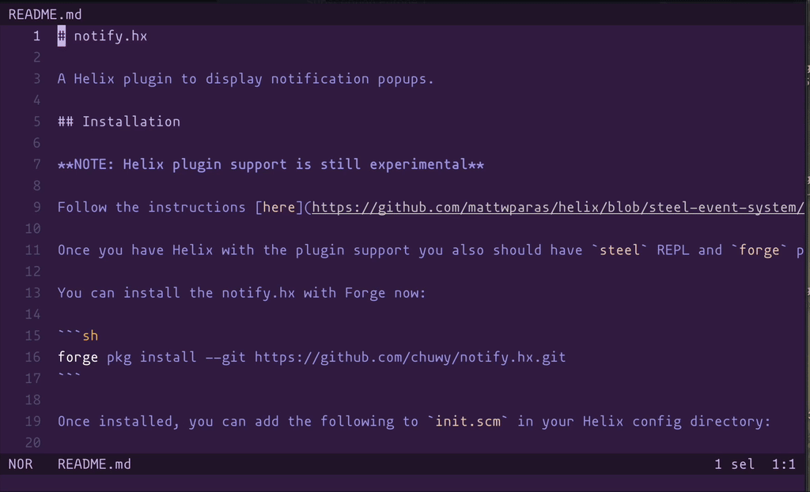

# notify.hx

A Helix plugin to display notification popups.



## Installation

**NOTE: Helix plugin support is still experimental**

Follow the instructions [here](https://github.com/mattwparas/helix/blob/steel-event-system/STEEL.md) to install Helix with its plugin branch.

Once you have Helix with the plugin support you also should have `steel` REPL and `forge` package manager.

You can install the notify.hx with Forge now:

```sh
forge pkg install --git https://github.com/chuwy/notify.hx.git
```

Once installed, you can add the following to `init.scm` in your Helix config directory:

```scheme
(require "notify/notify.scm")
```

## Usage

This plugin is intended to be used by other plugins from [Steel](https://github.com/mattwparas/steel):

```scheme
(require notify)

(notify "This is a minimal popup with info severity")

(notify "This is a warning showing some options" #:severity 'warning #:title "notify.hx demo" #:duration 10000)

(notify "...and an error" #:severity 'error #:title "notify.hx demo" #:duration 10000)

(notify "Have fun!" #:title "notify.hx demo" #:duration 2000)
```

But you also can invoke it as a plain command:

```
:notify "Works from here as well!"
```

## Why

Helix out of the box shows most informational messages in a statusline. Although it goes inline with Helix' minimalistic design it has some flaws:

* Tailored for fully synchronous work
* Just a single line of information
* No yank
* No additional metadata

notify.hx solves all these problem.

## Acknowledgments

* @mattwparas for his work on the plugin system for Helix and his help on Steel Discord
* @rcarriga for [nvim-notify](https://github.com/rcarriga/nvim-notify) where notify.hx draws an inspiration from
